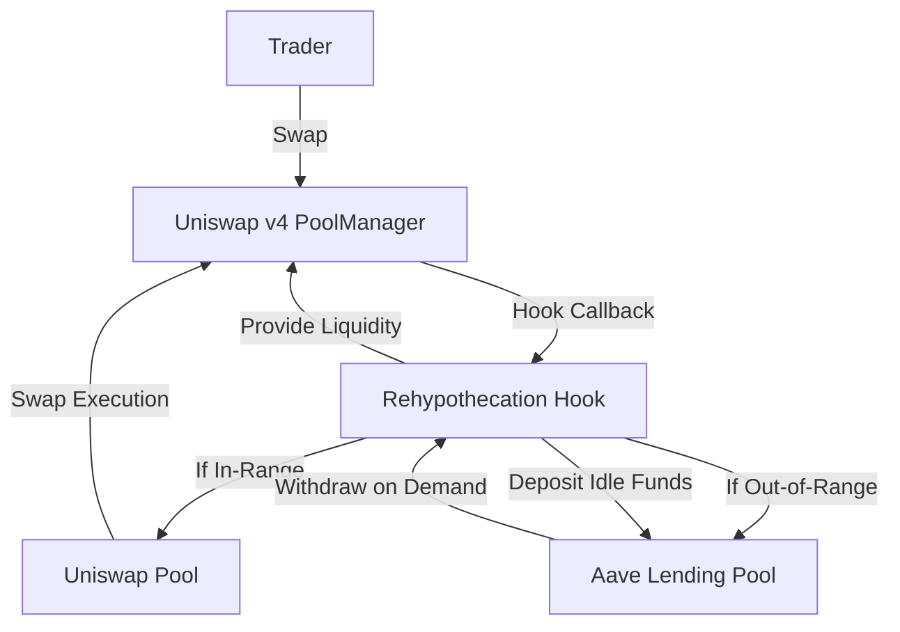

# Rehypothecation Hook 🔄💧

## Overview

This project is a **Uniswap v4 Hook** that automatically optimizes LP capital efficiency by integrating with Aave.  
When your Uniswap v4 liquidity position goes **out-of-range**, the hook deposits idle funds into Aave to earn lending yield.  
When the position returns **in-range**, the hook withdraws funds from Aave and reactivates liquidity in Uniswap.

**LPs earn both swap fees and lending yield, automatically.**

---

## Key Features & Updates

### ✨ Latest Additions

- **Full Uniswap v4 PoolManager Integration:**  
  - Now uses the actual pool contract address for all tick/price queries.
  - Calls `slot0()` on the pool contract, not PoolManager, for accurate tick data.
  - Added an `IPool` interface for direct pool contract interaction.

- **Improved Position Management:**  
  - Position keys are generated using `keccak256(abi.encodePacked(poolKey.toId(), tickLower, tickUpper))` for uniqueness.
  - Position state and liquidity data are managed via the `LiquidityOrchestrator` contract.

- **Enhanced Approvals:**  
  - All relevant tokens are approved for PoolManager, routers, orchestrator, and Aave contracts.
  - Orchestrator can now interact with Aave for deposits/withdrawals.

- **Encrypted Event Logging:**  
  - Uses Fhenix protocol for privacy-preserving event logs and encrypted tick storage.

- **Test Suite Refactor:**  
  - All tests now fetch tick and pool state from the actual pool contract.
  - Forked Sepolia network support for realistic integration testing.
  - Coverage reporting enabled via Foundry.

- **Modular Architecture:**  
  - All hooks, orchestrator, and Aave logic are separated for clarity and extensibility.

---

## Why These Changes?

- **Accuracy:**  
  - Fetching tick from the pool contract ensures correct state, especially on mainnet/forked networks.
- **Security:**  
  - Explicit approvals and modular contracts reduce risk and make audits easier.
- **Extensibility:**  
  - Modular design allows easy integration with other lending protocols (Compound, Morpho, etc.).
- **Privacy:**  
  - Fhenix encrypted events and storage protect sensitive LP data.

---

## How Does It Work? (Architecture)



### Flow

1. **Trader swaps** → PoolManager calls our Hook.
2. **Hook checks** if LP position is in-range or out-of-range.
3. **In-range:** Funds stay in Uniswap, earning swap fees.
4. **Out-of-range:** Funds move into Aave, earning lending yield until reactivated.

---

## Example Scenarios

- **🟢 In-Range:**  
  Bob LPs from tick 100–200. Price = 150 (in-range). Funds are in Uniswap, earning swap fees.

- **🔵 Out-of-Range:**  
  Price jumps to 300. Bob’s liquidity is now out-of-range. Hook deposits 80% into Aave, earning lending yield.

- **🟡 Back In-Range:**  
  Price returns to 150. Hook withdraws liquidity from Aave. Funds are back in Uniswap, earning swap fees again.

---

## Tech Stack

- **Uniswap v4 Core & Periphery** (hooks architecture)
- **Aave v3** (deposit/withdraw idle funds)
- **Fhenix** (privacy-preserving encrypted storage/events)
- **Foundry** (smart contract development, testing, coverage)

---

## How to Test

1. **Run all tests:**
   ```
   forge test -vvv --fork-url https://ethereum-sepolia-rpc.publicnode.com
   ```
2. **See coverage:**
   ```
   forge coverage --report summary
   ```
   For HTML report:
   ```
   forge coverage --report lcov && genhtml lcov.info --output-directory coverage
   ```

---

## What This Demonstrates

1. **Automatic liquidity optimization**
2. **Seamless swaps for traders (no interruptions)**
3. **Higher yields for LPs**
4. **A blueprint for cross-protocol hooks in Uniswap v4**
5. **Privacy-preserving DeFi infrastructure**

---

## Roadmap

- Extend support beyond Aave (Compound, Morpho, etc.)
- Build a frontend dashboard for LPs to monitor capital flows
- Deploy live demo on testnet/mainnet
- Add more privacy features and analytics

---

## License

MIT

---

🔥 **Hackathon Project:**  
Showcasing how Uniswap v4 Hooks unlock new financial primitives for LP capital efficiency and privacy.

