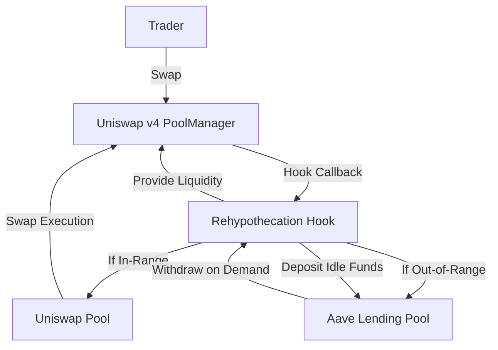

# Rehypothecation Hook 🔄💧

## What is this project?

This project is a **Uniswap v4 Hook** that makes LP capital more efficient.  
In normal Uniswap v4, when your liquidity is **out-of-range**, it just sits idle.  
With this hook, that idle liquidity is **automatically deposited into Aave** to earn lending yield.  
When it becomes **in-range again**, the hook **pulls it back into Uniswap** so it can earn swap fees.

👉 In simple terms: **LPs earn both swap fees and lending yield without doing anything extra.**

---

## Why is this important?

- Today, LPs on Uniswap v3/v4 lose yield when they are out-of-range.  
- This hook **solves that inefficiency** by ensuring idle capital is always productive.  
- It’s like giving LPs an **auto-pilot mode**:  
  - In-range → earns fees  
  - Out-of-range → earns Aave yield  

This creates a new category of **capital-efficient DeFi LPing**.

---

## How does it work? (Architecture)

Flow:

1.Trader swaps → PoolManager calls our Hook

2.Hook checks if LP position is in-range or out-of-range

3.If in-range → funds stay in Uniswap

4.If out-of-range → funds move into Aave until re-activated

Example Scenarios
🟢 Example 1: Normal Swap

Bob LPs from tick 100–200

Price = 150 (in-range)

His funds are fully in Uniswap → he earns swap fees

🔵 Example 2: Out-of-Range

Price jumps to 300

Bob’s liquidity is now out-of-range

Hook deposits 80% of it into Aave → Bob earns lending yield

🟡 Example 3: Back In-Range

Price returns to 150

Hook withdraws liquidity from Aave

Bob’s funds are back in Uniswap → he earns swap fees again

Tech Stack

Uniswap v4 Core & Periphery (hooks architecture)

Aave v2 (deposit/withdraw idle funds)

Foundry (smart contract development + testing)

What this demonstrates

1. Automatic liquidity optimization
2. Seamless swaps for traders (no interruptions)
3. Higher yields for LPs
4. A blueprint for cross-protocol hooks in Uniswap v4

Roadmap

Extend support beyond Aave (Compound, Morpho)

Build a frontend dashboard for LPs to monitor capital flows

Deploy live demo on testnet

License

MIT

🔥 Hackathon Project: Showcasing how Uniswap v4 Hooks unlock new financial primitives for LP capital efficiency.